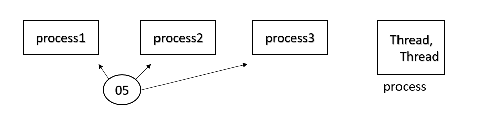
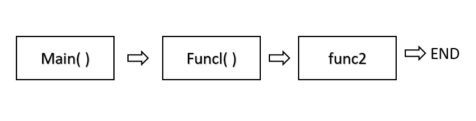
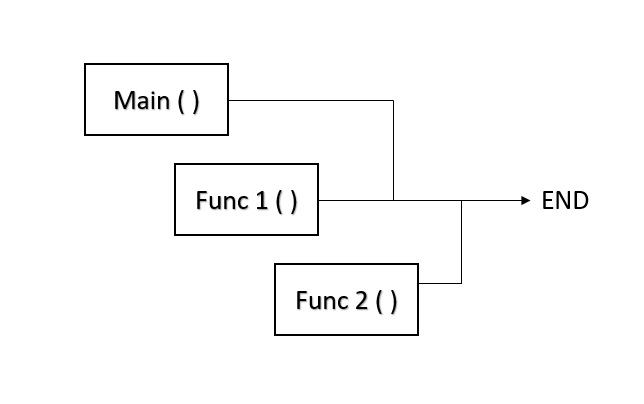
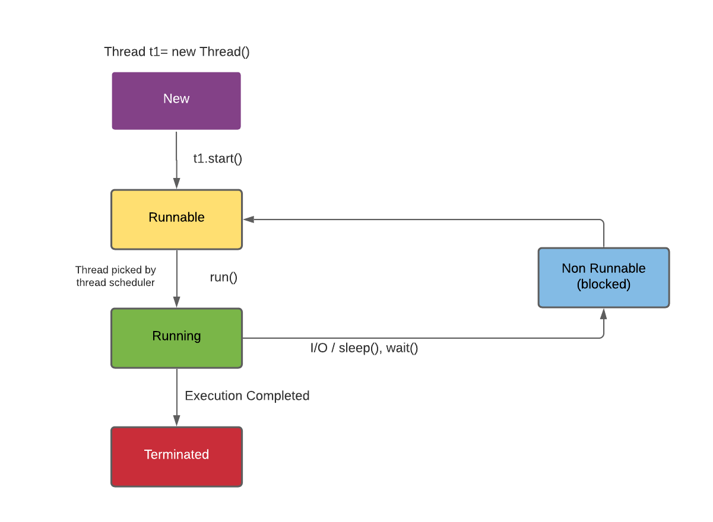
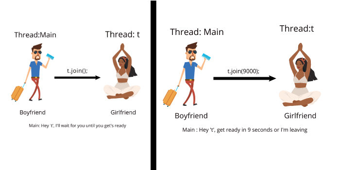

# Threading & Multi Threading


### 1. **Basics of Multi-threading**
#### **Explanation**:
- **Multi-threading** is a Java feature where multiple threads (small units of a process) run concurrently.
- Threads allow a program to perform multiple tasks simultaneously, improving performance, especially on multi-core processors.
- Java supports multi-threading through:
  - **`Thread class`**
  - **`Runnable interface`**

#### **Key Points**:
- Each thread runs independently, but shares the same memory space.
- Useful for tasks like downloading files, processing data, or running animations.

    

    

    

#### **Example**:
```java
class MyThread extends Thread {
    public void run() {
        System.out.println("Thread is running!");
    }
}

public class Main {
    public static void main(String[] args) {
        MyThread t1 = new MyThread();
        t1.start(); // Starts the thread
    }
}
```

---

### 2. **Main Thread**
#### **Explanation**:
- The **main thread** is the starting thread of every Java program.
- It executes the `main()` method.
- All other threads are child threads of the main thread.

#### **Key Points**:
- The JVM automatically creates the main thread when the program starts.
- You can control the main thread using the `Thread` class.

#### **Example**:
```java
public class MainThreadExample {
    public static void main(String[] args) {
        Thread t = Thread.currentThread();
        System.out.println("Main thread: " + t.getName());
    }
}
```

---

### 3. **Thread Life Cycle**
#### **Explanation**:
A thread goes through the following stages:
1. **New**: Created but not started (`Thread t = new Thread();`).
2. **Runnable**: Ready to run, waiting for CPU time (`t.start();`).
3. **Running**: Actively executing code.
4. **Blocked/Waiting**: Waiting for a resource or time to continue.
5. **Terminated**: Thread finishes execution.

#### **Key Points**:
- Use the `start()` method to move a thread from the **new** state to the **runnable** state.

    

#### **Example**:
```java
class MyThread extends Thread {
    public void run() {
        System.out.println("Thread is running!");
    }
}

public class Main {
    public static void main(String[] args) {
        Thread t = new MyThread();
        System.out.println("Thread state: " + t.getState()); // NEW
        t.start();
        System.out.println("Thread state: " + t.getState()); // RUNNABLE
    }
}
```

---

### 4. **Creation of Multiple Threads**
#### **Explanation**:
Multiple threads can be created using:
1. **Thread Class**:
   - Extend the `Thread` class.
2. **Runnable Interface**:
   - Implement the `Runnable` interface.

#### **Key Points**:
- Each thread runs independently.
- Threads share memory and resources.

#### **Example**:
```java
class MyThread extends Thread {
    public void run() {
        System.out.println("Thread " + Thread.currentThread().getName() + " is running.");
    }
}

public class Main {
    public static void main(String[] args) {
        MyThread t1 = new MyThread();
        MyThread t2 = new MyThread();
        t1.start();
        t2.start();
    }
}
```

---

### 5. **Thread Priorities**
#### **Explanation**:
- Java allows assigning priorities to threads, which helps the CPU decide the order of execution.
- Priorities range from `1` (MIN_PRIORITY) to `10` (MAX_PRIORITY). The default is `5` (NORM_PRIORITY).

#### **Key Points**:
- Use the `setPriority()` and `getPriority()` methods.
- Higher priority doesn’t guarantee execution order but increases the chances.

#### **Example**:
```java
public class ThreadPriorityExample {
    public static void main(String[] args) {
        Thread t1 = new Thread(() -> System.out.println("Thread 1"));
        Thread t2 = new Thread(() -> System.out.println("Thread 2"));

        t1.setPriority(Thread.MIN_PRIORITY);
        t2.setPriority(Thread.MAX_PRIORITY);

        t1.start();
        t2.start();
    }
}
```

---

### 6. **Thread Synchronization**
#### **Explanation**:
- Ensures that only one thread accesses a shared resource at a time to prevent data inconsistency.

#### **Key Points**:
- Use the `synchronized` keyword to lock a resource for one thread.

#### **Example**:
```java
class Counter {
    private int count = 0;

    public synchronized void increment() {
        count++;
    }

    public int getCount() {
        return count;
    }
}

public class Main {
    public static void main(String[] args) {
        Counter counter = new Counter();
        Thread t1 = new Thread(() -> counter.increment());
        Thread t2 = new Thread(() -> counter.increment());

        t1.start();
        t2.start();
    }
}
```

---

### 7. **Inter-thread Communication**
#### **Explanation**:
- Threads communicate using the `wait()`, `notify()`, and `notifyAll()` methods.
- Helps in coordinating threads.

#### **Key Points**:
- A thread waits for a condition using `wait()`.
- Another thread notifies it using `notify()`.

#### **Example**:
```java
class SharedResource {
    public synchronized void produce() throws InterruptedException {
        System.out.println("Producing...");
        wait();
        System.out.println("Resumed!");
    }

    public synchronized void consume() {
        System.out.println("Consuming...");
        notify();
    }
}

public class Main {
    public static void main(String[] args) {
        SharedResource resource = new SharedResource();

        new Thread(() -> {
            try {
                resource.produce();
            } catch (InterruptedException e) {}
        }).start();

        new Thread(() -> resource.consume()).start();
    }
}
```

---

### 8. **Deadlocks**
#### **Explanation**:
- Occurs when two or more threads are waiting for each other’s locked resources indefinitely.

#### **Key Points**:
- Deadlocks can freeze the program.
- Avoid by minimizing resource locking.

#### **Example**:
```java
public class DeadlockExample {
    public static void main(String[] args) {
        String resource1 = "Resource1";
        String resource2 = "Resource2";

        Thread t1 = new Thread(() -> {
            synchronized (resource1) {
                System.out.println("Thread 1 locked Resource1");
                synchronized (resource2) {
                    System.out.println("Thread 1 locked Resource2");
                }
            }
        });

        Thread t2 = new Thread(() -> {
            synchronized (resource2) {
                System.out.println("Thread 2 locked Resource2");
                synchronized (resource1) {
                    System.out.println("Thread 2 locked Resource1");
                }
            }
        });

        t1.start();
        t2.start();
    }
}
```

---

### 9. **Suspending and Resuming Threads**
#### **Explanation**:
- A thread can be temporarily suspended and resumed later.
- Java previously used `suspend()` and `resume()`, but they are deprecated due to deadlock risks. Instead, use flags.

#### **Example**:
```java
class MyThread extends Thread {
    private volatile boolean isSuspended = false;

    public void run() {
        while (true) {
            synchronized (this) {
                while (isSuspended) {
                    try {
                        wait();
                    } catch (InterruptedException e) {}
                }
            }
            System.out.println("Thread is running...");
            try {
                Thread.sleep(1000);
            } catch (InterruptedException e) {}
        }
    }

    public void suspendThread() {
        isSuspended = true;
    }

    public synchronized void resumeThread() {
        isSuspended = false;
        notify();
    }
}

public class Main {
    public static void main(String[] args) throws InterruptedException {
        MyThread t = new MyThread();
        t.start();

        Thread.sleep(3000);
        t.suspendThread();

        Thread.sleep(3000);
        t.resumeThread();
    }
}
```


### 10. **Java Thread Methods**
---

#### **1. `join()` Method in Java**
The `join()` method in Java allows one thread to wait until the execution of another specified thread is completed.  
- If `t` is a `Thread` object whose thread is currently executing, then `t.join()` causes the current thread to pause execution until `t`'s thread terminates.  
- The `join()` method puts the current thread on wait until the thread on which it is called is dead.

    

**Syntax:**  
```java
public final void join()
```

You can also specify the time for which the current thread will wait for the execution of a particular thread:  
**Syntax:**  
```java
public final void join(long millis)
```

---

#### **2. `sleep()` Method in Java**
The `sleep()` method is used to pause a thread for a specified amount of time. While the thread sleeps, the thread scheduler picks and executes another thread in the queue.  

- The `sleep()` method returns `void`.  
- It can be used for any thread, including the `main()` thread.

**Syntax:**  
```java
public static void sleep(long milliseconds) throws InterruptedException
public static void sleep(long milliseconds, int nanos) throws InterruptedException
```

**Parameters Passed to `sleep()` Method:**  
1. **`long milliseconds`:** Time in milliseconds for which the thread will sleep.  
2. **`int nanos`:** Additional time in nanoseconds, ranging from 0 to 999,999.  

**Example:**  
```java
import java.io.*;
import java.lang.Thread;

public class meth2 {
    public static void main(String[] args) {
        try {
            for (int i = 1; i <= 5; i++) {
                Thread.sleep(2000); // Sleep for 2 seconds
                System.out.println(i);
            }
        } catch (Exception e) {
            System.out.println(e);
        }
    }
}
```

**Output:**  
```
1  
2  
3  
4  
5  
```

In this example, the `main()` method sleeps for 2 seconds every time the loop executes.

---

#### **3. `interrupt()` Method**
The `interrupt()` method is used to interrupt a thread that is in a sleeping or waiting state.  

- It throws an `InterruptedException` if the thread is in a sleeping/blocked state.  
- If the thread is not in such a state, the interrupt flag is set to `true`, but no exception is thrown.  

**Syntax:**  
```java
public void interrupt()
```

---

#### **Scenarios for Using `interrupt()` Method**

**Case 1: Interrupting a thread that doesn’t stop working**  
```java
class Demo1 extends Thread {
    public void run() {
        try {
            for (int i = 0; i < 5; i++) {
                System.out.println("Child Thread");
                Thread.sleep(4000); 
                // Thread sleeps for 4000ms. Main thread interrupts it, generating InterruptedException.
            }
        } catch (InterruptedException e) {
            System.out.println("Child Thread Interrupted");
        }
        System.out.println("Thread is running");
    }
}

public class Demo {
    public static void main(String[] args) {
        Demo1 t = new Demo1();
        t.start();
        t.interrupt(); // Interrupt the child thread
        System.out.println("Main Thread");
    }
}
```

**Output:**  
```
Main Thread  
Child Thread  
Child Thread Interrupted  
Thread is running  
```

Here, the child thread comes out of the sleeping state due to the interruption but does not stop working.

---

**Case 2: Interrupting a thread that works normally**  
```java
class Demo2 extends Thread {
    public void run() {
        for (int i = 0; i < 10; ++i) {
            System.out.println(i);
        }
    }
}

public class Example {
    public static void main(String[] args) {
        Demo2 t = new Demo2();
        t.start();
        t.interrupt(); // Interrupt the thread
        System.out.println("Main Thread");
    }
}
```

**Output:**  
```
Main Thread  
0  
1  
2  
3  
4  
5  
6  
7  
8  
9  
```

Here, the thread works normally because no exception occurred during its execution. The `interrupt()` method only sets the thread flag to `true`.

---