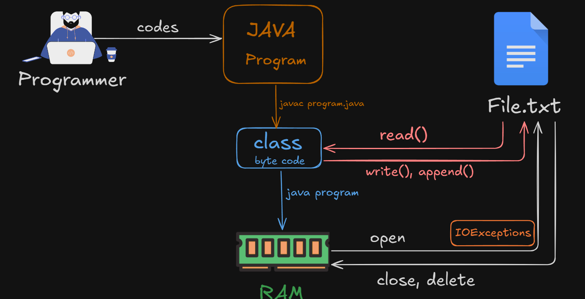

# File Handling in Java:

### **What is File Handling?**
- File handling in Java allows us to **create**, **read**, **write**, and **delete files** stored on a disk.
- The **`java.io`** package provides the classes for file handling, such as `File`, `FileReader`, `FileWriter`, and `BufferedReader`.
<br><br>



### **Common Operations in File Handling**

> 1. **Creating a File**
> 2. **Writing to a File**
> 3. **Reading from a File**
> 4. **Appending to a File**
> 5. **Deleting a File**

---

### 1. **Creating a File**
To create a file, use the `File` class and its `createNewFile()` method.

```java
import java.io.File;
import java.io.IOException;

public class FileCreationExample {
    public static void main(String[] args) {
        try {
            File file = new File("example.txt"); // File object
            if (file.createNewFile()) {
                System.out.println("File created: " + file.getName());
            } else {
                System.out.println("File already exists.");
            }
        } catch (IOException e) {
            System.out.println("An error occurred.");
            e.printStackTrace();
        }
    }
}
```

---

### 2. **Writing to a File**
Use the `FileWriter` class to write data to a file. If the file doesn't exist, it will be created automatically.

```java
import java.io.FileWriter;
import java.io.IOException;

public class FileWriteExample {
    public static void main(String[] args) {
        try {
            FileWriter writer = new FileWriter("example.txt");
            writer.write("Hello, this is a file handling example in Java!");
            writer.close();
            System.out.println("Data successfully written to the file.");
        } catch (IOException e) {
            System.out.println("An error occurred while writing to the file.");
            e.printStackTrace();
        }
    }
}
```

---

### 3. **Reading from a File**
Use the `FileReader` or `Scanner` class to read data from a file.

#### **Code Example (Using `FileReader`)**:
```java
import java.io.FileReader;
import java.io.IOException;

public class FileReadExample {
    public static void main(String[] args) {
        try {
            FileReader reader = new FileReader("example.txt");
            int character;
            while ((character = reader.read()) != -1) {
                System.out.print((char) character);
            }
            reader.close();
        } catch (IOException e) {
            System.out.println("An error occurred while reading the file.");
            e.printStackTrace();
        }
    }
}
```

#### **Code Example (Using `Scanner`)**:
```java
import java.io.File;
import java.io.FileNotFoundException;
import java.util.Scanner;

public class FileReadWithScanner {
    public static void main(String[] args) {
        try {
            File file = new File("example.txt");
            Scanner scanner = new Scanner(file);
            while (scanner.hasNextLine()) {
                String data = scanner.nextLine();
                System.out.println(data);
            }
            scanner.close();
        } catch (FileNotFoundException e) {
            System.out.println("File not found.");
            e.printStackTrace();
        }
    }
}
```

---

### 4. **Appending to a File**
Use the `FileWriter` class with the `append` flag set to `true`.

```java
import java.io.FileWriter;
import java.io.IOException;

public class FileAppendExample {
    public static void main(String[] args) {
        try {
            FileWriter writer = new FileWriter("example.txt", true); // 'true' enables appending
            writer.write("\nThis line is appended to the file.");
            writer.close();
            System.out.println("Data successfully appended to the file.");
        } catch (IOException e) {
            System.out.println("An error occurred while appending to the file.");
            e.printStackTrace();
        }
    }
}
```

---

### 5. **Deleting a File**
To delete a file, use the `File` class and its `delete()` method.

```java
import java.io.File;

public class FileDeleteExample {
    public static void main(String[] args) {
        File file = new File("example.txt");
        if (file.delete()) {
            System.out.println("File deleted: " + file.getName());
        } else {
            System.out.println("Failed to delete the file.");
        }
    }
}
```

---

### **Key Points about File Handling in Java**
1. **File Path**: Always provide the correct path of the file.
   - Example: `"C:\\Users\\User\\Documents\\example.txt"` for Windows.
2. **Exceptions**: Handle exceptions like `IOException` or `FileNotFoundException`.
3. **File Methods**: Common methods in the `File` class:
   - `exists()` – Checks if a file exists.
   - `canRead()` – Checks if a file is readable.
   - `canWrite()` – Checks if a file is writable.
   - `length()` – Returns the size of the file in bytes.

---


