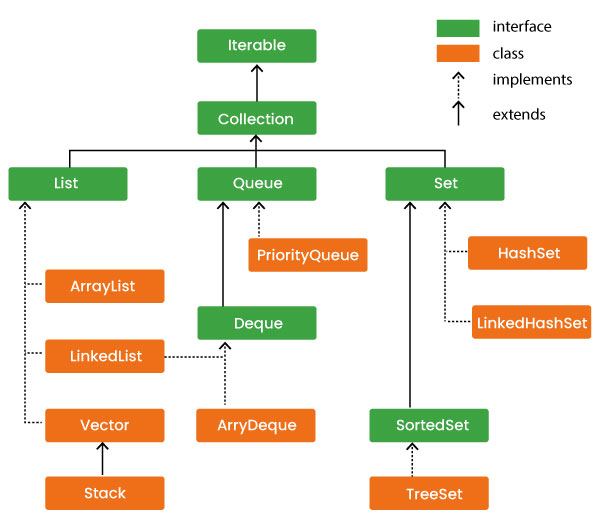

# Advance Java

### **1. Java Collections - Collection Hierarchy**

The Java Collections Framework provides a unified architecture for storing and manipulating a group of objects.

#### **Collection Hierarchy**:
1. **Interfaces**:
   - **Collection**: The root interface for most collection classes.
   - **List**: Ordered collection (ArrayList, LinkedList).
   - **Set**: No duplicate elements (HashSet, TreeSet).
   - **Queue**: Supports FIFO (PriorityQueue, ArrayDeque).
   - **Map**: Key-value pairs (HashMap, TreeMap).

2. **Classes**:
   - **ArrayList**: Dynamic arrays.
   - **LinkedList**: Doubly-linked list.
   - **HashSet**: Hash table for unique elements.
   - **TreeSet**: Sorted set.
   - **HashMap**: Key-value pairs, hash-based.
   - **TreeMap**: Sorted map.
<br><br>



---

### **2. ArrayList**
- A **resizable array** implementation of the `List` interface.
- **Features**:
  - Allows duplicate elements.
  - Preserves insertion order.
  - Allows random access.
  - Non-synchronized (not thread-safe).
- **Example**:
  ```java
  import java.util.ArrayList;

  public class Main {
      public static void main(String[] args) {
          ArrayList<String> list = new ArrayList<>();
          list.add("Apple");
          list.add("Banana");
          list.add("Apple");
          System.out.println(list); // [Apple, Banana, Apple]
      }
  }
  ```

---

### **3. LinkedList**
- A **doubly-linked list** implementation of the `List` and `Deque` interfaces.
- **Features**:
  - Allows duplicate elements.
  - Faster insertion and deletion compared to `ArrayList`.
  - Preserves insertion order.
  - Implements `Deque` (can be used as a stack or queue).
- **Example**:
  ```java
  import java.util.LinkedList;

  public class Main {
      public static void main(String[] args) {
          LinkedList<String> list = new LinkedList<>();
          list.add("Apple");
          list.addFirst("Orange");
          list.addLast("Banana");
          System.out.println(list); // [Orange, Apple, Banana]
      }
  }
  ```

---

### **4. ArrayDeque**
- A **resizable array implementation** of the `Deque` interface.
- **Features**:
  - Can function as both a stack and a queue.
  - Faster than `LinkedList` for stack/queue operations.
  - Does not allow `null` elements.
- **Example**:
  ```java
  import java.util.ArrayDeque;

  public class Main {
      public static void main(String[] args) {
          ArrayDeque<Integer> deque = new ArrayDeque<>();
          deque.addFirst(10);
          deque.addLast(20);
          deque.add(30);
          System.out.println(deque); // [10, 20, 30]
      }
  }
  ```

---

### **5. HashSet**
- A **hash table-based implementation** of the `Set` interface.
- **Features**:
  - No duplicate elements allowed.
  - Unordered.
  - Backed by a `HashMap`.
- **Example**:
  ```java
  import java.util.HashSet;

  public class Main {
      public static void main(String[] args) {
          HashSet<String> set = new HashSet<>();
          set.add("Apple");
          set.add("Banana");
          set.add("Apple"); // Duplicate element
          System.out.println(set); // [Apple, Banana]
      }
  }
  ```

---

### **6. Java.time API**
- Introduced in **Java 8**, provides classes for working with date and time.
- **Key Classes**:
  - `LocalDate`: Represents a date without time.
  - `LocalTime`: Represents time without date.
  - `LocalDateTime`: Represents both date and time.
  - `ZonedDateTime`: Represents date and time with timezone.
  - `Duration` and `Period`: Measure time between two dates/times.
- **Example**:
  ```java
  import java.time.LocalDate;
  import java.time.LocalTime;

  public class Main {
      public static void main(String[] args) {
          LocalDate today = LocalDate.now();
          LocalTime now = LocalTime.now();
          System.out.println("Date: " + today); // Date: YYYY-MM-DD
          System.out.println("Time: " + now);  // Time: HH:mm:ss
      }
  }
  ```

---

### **7. Java DateFormatter**
- A part of `java.time.format` package used to format and parse date-time objects.
- **Key Classes**:
  - `DateTimeFormatter`: Formats `LocalDate`, `LocalTime`, etc.
- **Example**:
  ```java
  import java.time.LocalDate;
  import java.time.format.DateTimeFormatter;

  public class Main {
      public static void main(String[] args) {
          LocalDate today = LocalDate.now();
          DateTimeFormatter formatter = DateTimeFormatter.ofPattern("dd-MM-yyyy");
          System.out.println("Formatted Date: " + today.format(formatter)); // e.g., 28-01-2025
      }
  }
  ```

---

### **8. Anonymous Classes & Lambda Expressions**
- **Anonymous Classes**:
  - A **class without a name**, created for single-use.
  - Typically used with interfaces or abstract classes.
  - **Example**:
    ```java
    Button button = new Button("Click Me");
    button.addActionListener(new ActionListener() {
        @Override
        public void actionPerformed(ActionEvent e) {
            System.out.println("Button clicked!");
        }
    });
    ```
- **Lambda Expressions**:
  - A **shorter syntax** for implementing functional interfaces.
  - Introduced in Java 8.
  - **Syntax**: `(parameters) -> {body}`
  - **Example**:
    ```java
    button.addActionListener(e -> System.out.println("Button clicked!"));
    ```

---

### **9. Generics in Java & Generic Classes**
- **Generics**:
  - Allows writing **type-safe** classes, methods, and interfaces.
  - Helps avoid `ClassCastException` and enables stronger type checks at compile time.
  - **Syntax**: `<T>` (type parameter).
- **Generic Class Example**:
  ```java
  class Box<T> {
      private T value;

      public void setValue(T value) {
          this.value = value;
      }

      public T getValue() {
          return value;
      }
  }

  public class Main {
      public static void main(String[] args) {
          Box<String> box = new Box<>();
          box.setValue("Hello");
          System.out.println(box.getValue()); // Hello
      }
  }
  ```
---