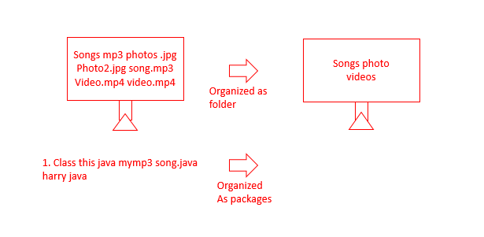

# Packages in Java:
- A package is used to group related classes.
- packages help in avoiding name conflicts 

There are two types of packages :
1. Build-in packages - java API 
2. User-defined packages - Custom packages 


<br><br>


## ***1. Using a java package :***

Import keyword is used to import packages in the java program. Example :

```java
import java lang * - import 
import java string -  import string from java long 
s = new java long string ( " Harry " ) -  use without importing
``` 


## ***2. User Defined Packages:***
- Make a folder, `Folder == Package`
- Make few classes & at the top write the package name/folder name:
  ```java 
  package employee
  ```
- compile all the the java files inside the package/folder using the command:
    ```powershell
    javac -d . *.java
    ```
- Make a main class/Like we were doing before make a Java class & inisde the main method import the package & use it just like importing java inbuilt packages
  
  ```java
    import employees.*;

    public class _1_Packages {
        public static void main(String[] args) {
    
            Tester tester = new Tester();            
            tester.displayRole();

        }
    }

  ```